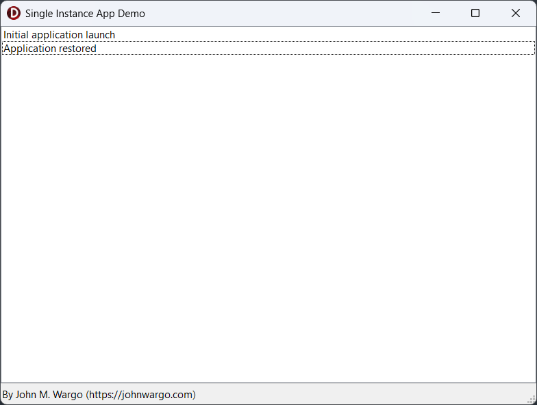

# Delphi Single Instance Demo

A sample Delphi application that illustrates how to implement a single instance of an application (where only one instance of the app runs at any time) along with passing runtime parameters to the single instance if another instance is launched (with runtime parameters, obviously).

I was trying to figure this out on my own when I discovered [How to run a single instance of an application](https://delphidabbler.com/articles/article-13) on the [Delphi Dabbler](https://delphidabbler.com/) site. The article does a great job of explaining the process and is chock full of source code and I learned how to make it work using that article. Kudos to @delphidabbler for all  his work on the article. 

I decided to publish this project since:

+ The article didn't include operational project source files I could compile and play around with.
+ The code in the article was a little hard to read
+ I wanted a version of the app I could run and test different scenarios to see how they all worked.

So, I took the code from the article, simplified it a bit and added a UI to it so I could watch it work in real time. I also published a description of the app and how it works to my blog at [Delphi Single Instance App With Runtime Parameters](https://johnwargo.com/posts/2025/delphi-single-instance-app-runtime-parameters/)

## Application Operation

When you run the application, the app displays a `listbox` displaying messages from the application. Every time another instance launches, the app updates the list.

For example, when I navigate to the project folder and launch another instance of the application, the screen updates to indicate that the application was restored.

What this means is that when I launched the second instance of the application, the application:

1. Realized there was another copy of the application running.
2. Activated the initial instance of the application.
3. Terminated the new application instance.

In this case, **Activated** means passing control to the initial instance and, if the initial instance was minimized, displayed the application window (whatever you call the opposite of minimized (but not maximized)).

Next, I made a shortcut for the application on my desktop and added a runtime parameter to the **Target** property (`test` in this example). 

Then, when I double-clicked on the shortcut, the application launches with the runtime parameter (`test`) and the new instance:

1. Realized there was another copy of the application running.
2. Send the runtime parameters to the initial instance of the application.
3. Activated the initial instance of the application.
4. Terminated the new application instance.

***

You can find information on many different topics on my [personal blog](https://www.johnwargo.com). Learn about all of my publications at [John Wargo Books](https://www.johnwargobooks.com).

If you find this code useful and feel like thanking me for providing it, please consider <a href="https://buymeacoffee.com/johnwargo" target="_blank">Buying Me a Coffee</a>, or making a purchase from [my Amazon Wish List](https://amzn.com/w/1WI6AAUKPT5P9).
